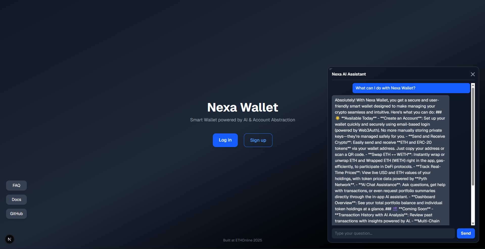
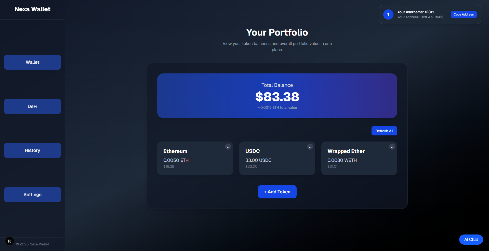
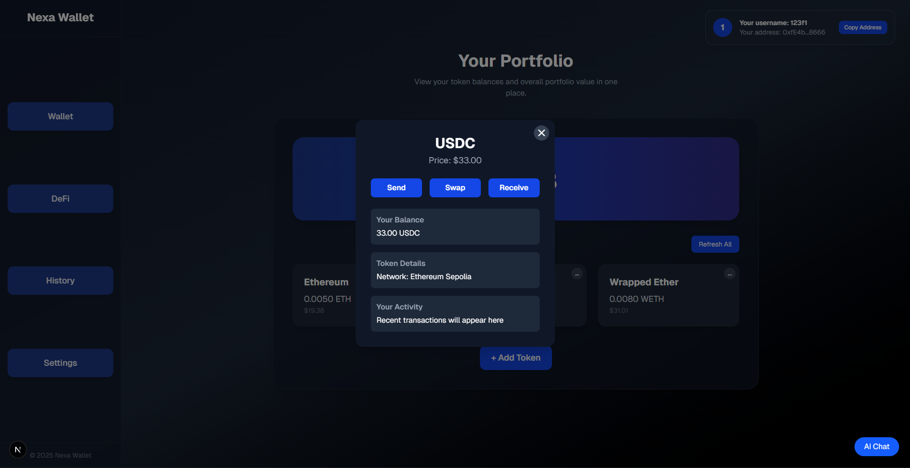

#  Nexa Wallet

##  Project Overview

**Nexa Wallet** is a **smart crypto wallet** designed to make onboarding into Web3 simple, intuitive, and user-friendly.  
It combines a **minimalist interface** with an integrated **AI assistant** that helps users understand the wallet, navigate features, and get guidance without needing deep crypto knowledge.  

Currently, Nexa Wallet can be deployed on **Sepolia** and interact with **Uniswap** for token swaps. While full Account Abstraction support via EntryPoint is planned for future updates, the wallet already demonstrates a clean, modern approach to managing, sending, and swapping assets with AI-powered guidance for beginners.

## Key Features

- **Send & Receive Tokens:** Transfer ETH and ERC-20 tokens easily with a clean, intuitive interface.  
- **Swap via Uniswap:** Swap any supported tokens directly inside the wallet using Uniswap.  
- **Real-time Balances & Prices:** View token balances in both crypto and USD, with prices fetched in real-time via **Pyth Network**.  
- **AI Assistant:** Integrated **AI agent** answers user questions and guides through wallet features using project documentation.  
- **Simple Web2-style Registration:** Sign up with username and password — no complex setup needed for beginners.  
- **Supported Services & Protocols:**  
  - **Uniswap** — token swapping  
  - **Pyth Network** — real-time token prices  
  - **AI Agent** — guidance and support  
- **Planned Features:** Future support for **Account Abstraction (EntryPoint)** and improved security mechanisms.  

## Architecture

Nexa Wallet consists of several key components that work together to provide a seamless and user-friendly Web3 experience:

### 1. Frontend
- Built with **React / Next.js**, it handles user interactions including:
  - Registration and login (Web2-style username + password)
  - Displaying balances in tokens and USD
  - Token swaps via **Uniswap**
  - AI assistant UI for answering user questions
- Private keys never leave the frontend; the EOA (Externally Owned Account) is derived locally from the username, password, and salt.

### 2. Backend
- Powered by **Flask** and **MongoDB**, the backend manages:
  - User registration and login, storing **username, public EOA address, and NexaAccount address** (AA) securely
  - AI agent functionality — queries from the frontend are sent to the AI service, which responds with guidance
  - Temporary funding of new accounts (e.g., sending 0.00025 ETH for gas)
- The backend does **not store private keys** — all sensitive data remains on the client.

### 3. Smart Contracts
- **NexaAccount.sol** — main wallet contract for each user; functions can be invoked by the user's EOA or the EntryPoint (planned for future support)
- **NexaAccountFactory.sol** — deploys a new NexaAccount when a user registers
- Contracts interact directly with the frontend via the user's EOA, enabling token transfers, swaps, and future AA features.

### 4. AI Agent
- Implemented as a separate service using the **ASI1 framework**
- Processes user queries, leveraging the project documentation to provide accurate guidance
- Integrated via backend API; the frontend sends questions and displays the AI-generated responses
- Ensures security best practices by never exposing private keys or API secrets to the frontend

### 5. Data Flow Overview
1. User interacts with the **frontend** (balance, swap, AI queries)
2. Frontend communicates with **backend** for:
   - User authentication
   - AI responses
   - Public wallet address management
3. Frontend interacts directly with **smart contracts** for blockchain operations
4. AI Agent fetches context and answers from the backend, returning guidance to the frontend UI

This architecture separates concerns cleanly: the **frontend** handles sensitive key material and UI, the **backend** manages AI and user metadata, and the **smart contracts** manage on-chain state.

## 🖥️ Interface Preview

### 1. Dashboard
Shows the screen before the user has registered a wallet. The user asks a question to the AI assistant in the bottom-right corner, and receives an immediate helpful response.

<p align="center">
  
</p>

### 2. Swap Interface
Displays the interface after the user has registered. Here, all wallet interactions are accessible, including balances, swaps, and transaction management.
<p align="center">
  
</p>

### 3. AI Assistant
Shows a single token card where the user can send, swap, or receive the token. Additional token information is also displayed for easy reference.
<p align="center">
  
</p>

## Getting Started

Follow these steps to set up and run Nexa Wallet locally.

### 1. Clone the repository
```bash
git clone https://github.com/WhatFate/nexa-wallet
cd nexa-wallet
```

### 2. Backend Setup

1. **Create a Python virtual environment**

```bash
python3 -m venv venv
source venv/bin/activate
```

2. **Install dependencies**

```bash
pip install -r backend/requirements.txt
```

3. **Configure environment variables**
   Create a `.env` file in the `backend/` folder with the following keys:

```env
ALCHEMY_RPC_URL=
PRIVATE_KEY=
ETHERSCAN_API_KEY=
ENTRYPOINT_ADDRESS=
SWAPROUTER_ADDRESS=
ACCOUNT_FACTORY=  # Use deployed NexaAccountFactory on Sepolia: 0xA806d1B2cb8219877749C9Ccd5E0eA5B51bdC340
SALT=
MONGO_URI=
ASI1_API_KEY=
```

4. **Start MongoDB** (if not already running)

```bash
sudo systemctl start mongod
sudo systemctl status mongod
```

5. **Run the backend services**

```bash
python app.py
uvicorn app:app --port 8001 --reload
```

### 3. Frontend Setup

1. Go to the frontend folder and install dependencies:

```bash
cd frontend
npm install
```

2. Start the development server:

```bash
npm run dev
```

> The frontend connects to the backend API for registration, AI assistant, and wallet operations.

### 4. Smart Contracts

1. Install **Foundry** if not already installed:

```bash
curl -L https://foundry.paradigm.xyz | bash
foundryup
```

2. Deploy contracts (optional if using pre-deployed on Sepolia):

```bash
cd contracts
forge build
forge script script/DeployFactory.s.sol --rpc-url $RPC_URL --broadcast --private-key $PRIVATE_KEY
```

3. Update the `ACCOUNT_FACTORY` variable in `.env` with the deployed contract address.

### 5. AI Agent

1. Make sure `ASI1_API_KEY` is set in the backend `.env`.
2. The AI agent runs as part of the backend (`app.py`) and responds to frontend queries.

### 6. Test Wallet

* Make sure your Sepolia wallet has some test ETH for deploying NexaAccount and performing transactions.
* Register a user, create a wallet, and explore balances, swaps, and AI assistant functionality.

### Notes

* Always start **backend first**, then **frontend**.
* Private keys remain only on the frontend; backend stores only public addresses (`EOA` and `AA`).
* Minimal ETH is required for gas when creating NexaAccount wallets and performing swaps.

## Tech Stack

### Frontend
- **Framework & Language:** Next.js, React, TypeScript  
- **State & Wallet Management:** Wagmi, @aa-sdk/core, @aa-sdk/ethers  
- **UI & Styling:** TailwindCSS  
- **Utilities:** qrcode.react, dotenv, viem  
- **Blockchain Interaction:** ethers.js, Pyth Network price feeds  

### Backend
- **Language & Framework:** Python, Flask, FastAPI  
- **AI Agent Integration:** uagents, requests  
- **Database:** MongoDB (user data and wallet addresses)  
- **Environment Management:** python-dotenv  
- **Blockchain Interaction:** web3.py  

### Smart Contracts
- **Language & Tools:** Solidity, Foundry  
- **Libraries:** OpenZeppelin, @account-abstraction/contracts  
- **Deployment & Testing:** Foundry CLI  

### AI Agent
- **Framework:** ASI1 (Artificial Superintelligence Alliance)  
- **Integration:** Backend handles API requests, frontend queries AI via backend  
- **Functionality:** Provides guidance to users on wallet operations, swaps, and features  

### External Services & Networks
- **DeFi Protocols:** Uniswap (swap tokens)  
- **Price Feeds:** Pyth Network (real-time token prices)  
- **Testnet:** Sepolia (for wallet deployment and testing)  

### Development Environment
- **Frontend:** TypeScript, Node.js, npm  
- **Backend:** Python 3.11+, virtualenv  
- **Smart Contracts:** Solidity, Foundry, OpenZeppelin  
- **Database:** MongoDB

##  License

[](assets/LICENSE)

